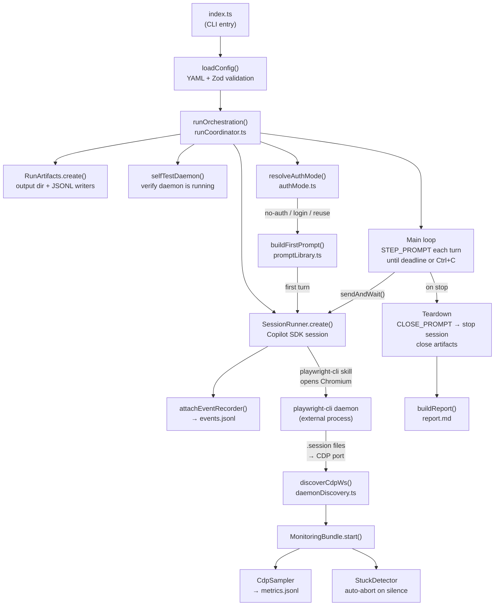

# Architecture

## Workflow Diagram



## Module Map

| Module | File | Responsibility |
|---|---|---|
| Entry point | `src/index.ts` | Parse CLI args, load config, call `runOrchestration` |
| Orchestrator | `src/runCoordinator.ts` | Wire all modules; own the run lifecycle |
| Config | `src/config.ts` | YAML load + Zod schema validation |
| Auth mode | `src/authMode.ts` | Decide no-auth / reuse / login-then-save |
| Session runner | `src/sessionRunner.ts` | Wrap Copilot SDK `CopilotClient` + `CopilotSession` |
| Prompt library | `src/promptLibrary.ts` | All LLM prompt text (system, first, step, close) |
| Daemon discovery | `src/daemonDiscovery.ts` | Locate playwright-cli daemon and resolve its CDP WebSocket URL |
| Run artifacts | `src/runArtifacts.ts` | Create output directory, own JSONL writers, path constants |
| Event recorder | `src/eventRecorder.ts` | Subscribe to SDK session events → `events.jsonl` |
| Monitoring bundle | `src/monitoringBundle.ts` | Start/stop `CdpSampler` + `StuckDetector` as one unit |
| CDP sampler | `src/cdpSampler.ts` | Poll browser performance metrics over CDP → `metrics.jsonl` |
| Stuck detector | `src/stuckDetector.ts` | Watchdog: abort agent turn if no ping within threshold |
| Report builder | `src/reportBuilder.ts` | Join JSONL streams into `report.md` |

## Key Data Flows

### 1. Startup
```
index.ts → loadConfig → runOrchestration
  → RunArtifacts.create()        (output dir)
  → selfTestDaemon()             (smoke-test daemon files exist)
  → SessionRunner.create()       (Copilot SDK session with skill + system prompt)
  → attachEventRecorder()        (session events → events.jsonl)
  → resolveAuthMode() → buildFirstPrompt() → sendAndWait()
```

### 2. Browser open + CDP attach
```
agent turn (playwright-cli open <url>)
  → playwright-cli daemon writes .session file
  → discoverCdpWs() reads .session → extracts --remote-debugging-port → fetches /json/version
  → MonitoringBundle.start()
      CdpSampler.start()   (interval polling → metrics.jsonl)
      StuckDetector.start() (watchdog on session events)
```

### 3. Main loop
```
while !stopped && Date.now() < deadline:
  sendAndWait(STEP_PROMPT)
    agent explores, issues playwright-cli commands, appends to findings.jsonl
    session emits events (captured by EventRecorder)
    StuckDetector.ping() on every event
```

### 4. Teardown
```
Ctrl+C or deadline reached
  → MonitoringBundle.stop()
  → sendAndWait(CLOSE_PROMPT)   (agent closes browser cleanly)
  → runner.stop()                (kill Copilot SDK subprocess)
  → artifacts.close()            (flush JSONL buffers)
  → buildReport()                (events + metrics + findings → report.md)
```

## Output Directory Structure

```
runs/
  2026-05-05T10-30-00-000Z/
    events.jsonl          ← SDK session events (messages, tool calls, usage, idle)
    metrics.jsonl         ← CDP metric samples (JS heap, DOM nodes, listeners)
    findings.jsonl        ← Agent-authored bug reports (severity, repro, evidence)
    report.md             ← End-of-run markdown summary
    browser-endpoint.txt  ← CDP WebSocket URL used by the sampler
    screenshots/          ← Agent-captured evidence (PNG/JPG)
```
