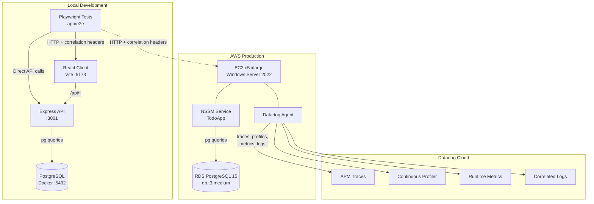
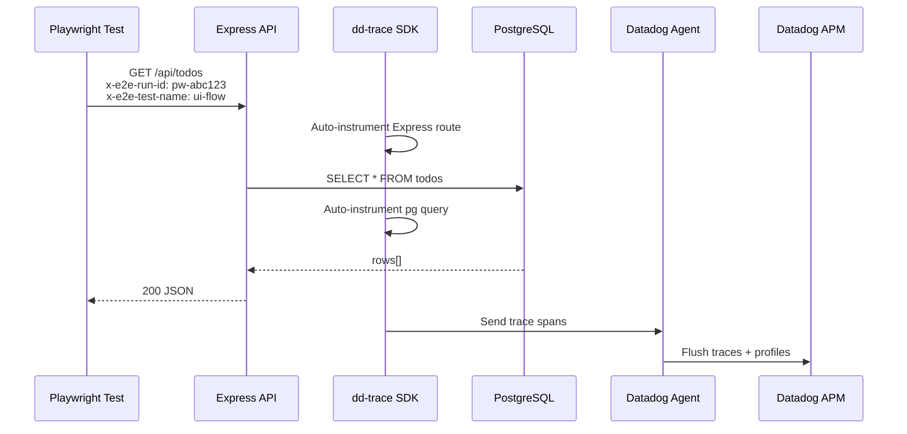
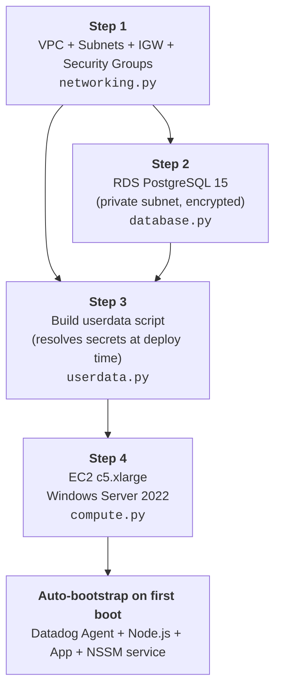
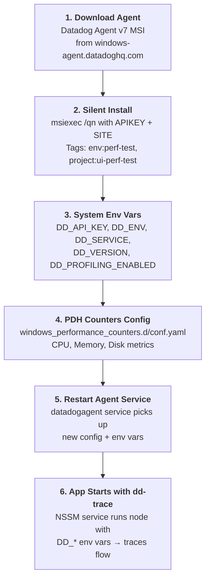

# E2E Real-Time Monitoring

End-to-end testing environment with **Datadog APM tracing** baked into every layer — from the Playwright test runner, through the Express API, down to PostgreSQL queries. Every test run produces a correlated trace you can follow in Datadog to pinpoint exactly which test caused which slow query or error.

## Why This Exists

Traditional e2e tests tell you **pass or fail**. They don't tell you *why* a checkout flow took 4 seconds or which database query spiked during the "toggle todo" step.

This project solves that by wiring **observability directly into the test pipeline**:

- Playwright injects correlation headers (`x-e2e-run-id`, `x-e2e-test-name`) into every HTTP request
- The Express API reads those headers and tags every Datadog trace span with the originating test
- `start-e2e.ps1` can run the full local stack, execute tests, and validate local Datadog intake in one step
- You can open Datadog APM, search by `e2e.run_id`, and see the full distributed trace — from browser click to SQL execution — for a single test case

The result: when a test fails or slows down, you already have the production-grade telemetry to debug it.

## Architecture



## Datadog Integration

### How Tracing Works



### APM Setup (dd-trace)

The server bootstrap is split between `app/server/src/index.ts` and `app/server/src/app.ts`. `index.ts` initializes `dd-trace` first, then loads `app.ts` so the SDK can patch Express, `pg`, and HTTP modules before those imports are used:

```typescript
import tracer from 'dd-trace';
tracer.init({
  service:        'todo-api',
  env:            'perf-test',
  version:        '1.0.0',
  profiling:      true,        // CPU + heap + wall-clock profiles
  logInjection:   true,        // inject trace_id/span_id into console logs
  runtimeMetrics: true,        // event loop lag, GC stats, heap usage
});

require('./app');
```

| Feature | What It Does |
|---|---|
| **APM Traces** | Every Express route + pg query becomes a span in a distributed trace |
| **Continuous Profiler** | CPU flame graphs and heap snapshots attached to traces |
| **Log Correlation** | `dd.trace_id` and `dd.span_id` injected into log lines for log↔trace linking |
| **Runtime Metrics** | Node.js event loop lag, GC pause time, active handles sent to Datadog |

### E2E Correlation Headers

Playwright attaches these headers to every request (configured in `playwright.config.ts` and `tests/helpers.ts`):

| Header | Purpose | Example |
|---|---|---|
| `x-e2e-run-id` | Unique ID per test run | `pw-1713000000-a1b2c3d4` |
| `x-e2e-source` | Identifies traffic origin | `playwright-e2e` |
| `x-e2e-test-name` | Current test case name | `ui-flow--create-toggle-delete` |

The API logs these alongside Datadog trace IDs, so you can search in Datadog:
```
service:todo-api @e2e.run_id:pw-1713000000-a1b2c3d4
```
...and see every trace span generated by that specific test run.

## Project Structure

```
├── app/
│   ├── client/          # React + Vite frontend
│   ├── server/          # Express API with dd-trace
│   │   ├── src/
│   │   │   ├── index.ts       # dd-trace init + bootstrap loader
│   │   │   ├── app.ts         # Express app, routes, middleware, static hosting
│   │   │   ├── routes/todos.ts # CRUD with e2e correlation logging
│   │   │   └── db.ts          # pg pool (reads PG* env vars)
│   │   └── migrations/
│   │       └── 001_todos.sql  # Schema + updated_at trigger
│   └── e2e/             # Playwright test workspace
│       ├── playwright.config.ts  # local + ec2 projects, correlation headers
│       └── tests/
│           ├── todo.spec.ts     # UI flow + API flow tests
│           └── helpers.ts       # e2eHeaders(), uniqueTitle(), cleanup
├── infra/               # Pulumi IaC (Python)
│   ├── __main__.py      # Orchestration: network → database → userdata → compute
│   ├── networking.py    # VPC, subnets, IGW, security groups
│   ├── database.py      # RDS PostgreSQL 15 (private subnet, encrypted)
│   ├── compute.py       # EC2 c5.xlarge Windows Server 2022
│   ├── iam.py           # EC2 IAM role, instance profile, SSM policy
│   ├── storage.py       # S3 artifact bucket
│   ├── userdata.py      # PowerShell bootstrap: Datadog Agent + app deploy
│   └── config.py        # Pulumi secrets (DD API key, RDS password)
├── build-artifact.ps1   # Build & upload app artifact to S3
├── check-traces.ps1     # Local Datadog intake validation helper
├── setup-db.ps1         # Initialize database schema
├── start-e2e.ps1        # One-command: DB → server → client → tests → trace validation
├── stop-e2e.ps1         # Teardown all services
├── start-db.ps1         # Docker PostgreSQL only
├── stop-db.ps1          # Stop Docker PostgreSQL
├── docker-compose.yml   # PostgreSQL 16-alpine container
└── datadog/
    └── scripts/
        └── start-datadog-agent.ps1 # Local Datadog Agent container helper
```

## Running Locally

### Prerequisites

- **Docker Desktop** — for the PostgreSQL container
- **Node.js 20+** — runtime
- **PowerShell 5.1+** — orchestration scripts
- **Datadog API key** — required for the local Datadog Agent container helper

### Start Datadog Agent

```powershell
# Start the local Datadog Agent container once per machine/session
cd datadog\scripts
.\start-datadog-agent.ps1 -ApiKey <YOUR_DATADOG_API_KEY>

# Return to the example root afterwards
cd ..\..
```

### One-Command Start

```powershell
# Start everything, run tests, and automatically validate local Datadog intake
.\start-e2e.ps1

# Start with a fixed run id so the final output gives you an exact Datadog search query
.\start-e2e.ps1 -RunId pw-demo-001

# Start without running tests (keep services up for manual testing)
.\start-e2e.ps1 -SkipTests

# Silent mode — hidden windows, logs written to .e2e-logs/
.\start-e2e.ps1 -Silent

# Teardown
.\stop-e2e.ps1

# Validate local Datadog intake and print a Datadog search query
.\check-traces.ps1 -RunId pw-demo-001

# Optional: probe through the live API route instead of the default direct dd-trace probe
.\check-traces.ps1 -RunId pw-demo-001 -ProbeMode api
```

`start-e2e.ps1` now prints three values at the end of a successful run:

- the Datadog run id
- the Datadog APM search query
- a local trace validation result from `check-traces.ps1`

### Manual Start (Step by Step)

```powershell
# 1. Start PostgreSQL container
.\start-db.ps1

# 2. Start backend (new terminal)
cd app
npm run dev:server

# 3. Start frontend (new terminal)
cd app
npm run dev:client

# 4. Run e2e tests (new terminal)
cd app
npm run test:e2e          # local project only
npm run test:e2e:ui       # Playwright UI mode
```

To use a fixed run id in the manual flow:

```powershell
$env:E2E_RUN_ID='pw-demo-001'
cd app
npm run test:e2e
```

Open http://localhost:5173 in a browser.

## Infrastructure Setup (Step by Step)

### Prerequisites

| Tool | Version | Purpose |
|---|---|---|
| [Pulumi CLI](https://www.pulumi.com/docs/install/) | 3.x | Infrastructure as Code engine |
| [Python](https://www.python.org/) | 3.9+ | Pulumi runtime (uses `uv` for dependency management) |
| [AWS CLI](https://aws.amazon.com/cli/) | 2.x | AWS credential management |
| [Datadog Account](https://www.datadoghq.com/) | — | You need an API key from **Organization Settings → API Keys** |

### Step 1 — Configure AWS Credentials

Make sure your AWS CLI is configured with credentials that have permission to create VPC, EC2, RDS, and Security Group resources:

```powershell
aws configure
# AWS Access Key ID:     <your-key>
# AWS Secret Access Key: <your-secret>
# Default region:        us-east-1
# Default output format: json
```

### Step 2 — Get Your Datadog API Key

1. Log into [Datadog](https://app.datadoghq.com/)
2. Go to **Organization Settings** → **API Keys**
3. Click **+ New Key**, name it `perf-test-env`
4. Copy the key — you'll need it in Step 4

### Step 3 — Initialize the Pulumi Stack

```powershell
cd infra

# Create a virtual environment and install dependencies
uv sync

# Initialize or select the dev stack
pulumi stack init dev
# Or if it already exists:
pulumi stack select dev
```

### Step 4 — Set Pulumi Configuration & Secrets

```powershell
# AWS region
pulumi config set aws:region us-east-1

# Datadog API key (stored encrypted in Pulumi state)
pulumi config set --secret dd-api-key <YOUR_DATADOG_API_KEY>

# RDS database password (stored encrypted)
pulumi config set --secret rds-password <YOUR_SECURE_DB_PASSWORD>

# (Optional) Override the default repository URL
pulumi config set repo-url https://github.com/vtanathip/sdet-ai-handbook.git
```

Verify everything is set:
```powershell
pulumi config
# KEY                              VALUE
# aws:region                       us-east-1
# perf-test-env:dd-api-key         [secret]
# perf-test-env:rds-password       [secret]
# perf-test-env:repo-url           https://github.com/...
```

### Step 5 — Deploy

```powershell
pulumi up
```

Pulumi provisions resources in this order:



### Step 6 — Verify the Deployment

```powershell
# Get the EC2 public IP
pulumi stack output instance_public_ip

# Get the RDS endpoint
pulumi stack output rds_endpoint
```

Wait 5–10 minutes for the EC2 userdata to finish bootstrapping, then verify:

```powershell
# The React app is served by the Express process on port 3001.
# Health check — should return {"status":"ok"}
curl http://<EC2_PUBLIC_IP>:3001/health

# Open the UI
start http://<EC2_PUBLIC_IP>:3001
```

If the health check times out, the instance is usually still bootstrapping the
application or the Windows service failed during startup. RDP to the instance
and inspect:

```powershell
Get-Service TodoApp
nssm status TodoApp
Get-Content C:\Windows\Temp\todo-bootstrap.log -Tail 200
Get-Content C:\app\logs\stdout.log -Tail 200
Get-Content C:\app\logs\stderr.log -Tail 200
```

### What Gets Provisioned

| Resource | Spec | Purpose |
|---|---|---|
| VPC | `10.0.0.0/16` — 1 public + 2 private subnets | Network isolation |
| Security Groups | EC2 SG (3001, 443, 8126, 3389) + RDS SG (5432 from EC2 only) | App access + least-privilege data access |
| RDS | PostgreSQL 15, `db.t3.medium`, gp3, encrypted, private subnet | Database (not publicly accessible) |
| EC2 | `c5.xlarge` Windows Server 2022 Full, gp3 50GB, public IP | Compute-optimized app host |
| Datadog Agent | v7 MSI, auto-installed | APM + profiling + Windows perf counters |
| NSSM Service | `TodoApp` registered as Windows service | Auto-start Node.js API and serve the built React client on boot |

---

## Datadog Setup (Step by Step)

### What Happens Automatically (via EC2 userdata)

When the EC2 instance boots, the PowerShell userdata script (`infra/userdata.py`) performs the full Datadog setup — **no manual configuration needed**:



### Step 1 — Agent Installation (automated)

The userdata downloads and installs the Datadog Agent MSI with these settings:

| Setting | Value |
|---|---|
| `APIKEY` | Your Datadog API key (from Pulumi secret) |
| `SITE` | `datadoghq.com` |
| `TAGS` | `env:perf-test`, `project:ui-perf-test`, `team:qa-automation` |

### Step 2 — Environment Variables (automated)

These are set at the **Machine level** so both the Agent and the Node.js app read them:

| Variable | Value | Used By |
|---|---|---|
| `DD_API_KEY` | *(secret)* | Datadog Agent |
| `DD_ENV` | `perf-test` | Agent + dd-trace |
| `DD_SERVICE` | `todo-api` | dd-trace (service name in APM) |
| `DD_VERSION` | `1.0.0` | dd-trace (version tag on traces) |
| `DD_PROFILING_ENABLED` | `true` | dd-trace (continuous profiler) |

### Step 3 — Windows Performance Counters (automated)

A `conf.yaml` is written to `C:\ProgramData\Datadog\conf.d\windows_performance_counters.d\`:

| Counter | Metric Name |
|---|---|
| `\Processor(_Total)\% Processor Time` | `cpu.percent_processor_time` |
| `\Memory\Available MBytes` | `memory.available_mbytes` |
| `\LogicalDisk(_Total)\% Free Space` | `disk.percent_free_space` |

### Step 3.5 — App Access and Bootstrap Diagnostics (automated)

The userdata script also configures the host so the application can be reached
from a browser and so startup failures are easier to inspect:

| Item | Behavior |
|---|---|
| Windows Firewall | Opens inbound TCP `3001` for the Todo app |
| Bootstrap transcript | Writes provisioning logs to `C:\Windows\Temp\todo-bootstrap.log` |
| Readiness check | Waits for `localhost:3001` before marking bootstrap complete |

### Step 4 — Application-Level Tracing (dd-trace SDK)

The `dd-trace` npm package is initialized as the **very first import** in the server:

```typescript
// app/server/src/index.ts — MUST be the first import
import tracer from 'dd-trace';
tracer.init({
  service:        'todo-api',
  env:            'perf-test',
  version:        '1.0.0',
  profiling:      true,
  logInjection:   true,
  runtimeMetrics: true,
});
// All subsequent imports (express, pg) are auto-instrumented
```

This gives you:
- **APM Traces** — every Express route handler and pg query as spans
- **Continuous Profiler** — CPU flame graphs, heap snapshots, wall-clock profiles
- **Log Correlation** — `dd.trace_id` and `dd.span_id` injected into `console.log` output
- **Runtime Metrics** — event loop lag, GC pause time, heap usage

### Step 5 — Verify in Datadog

After deployment, confirm telemetry is flowing:

1. **Infrastructure → Host Map** — look for the EC2 instance hostname
2. **APM → Services** — `todo-api` should appear with traces
3. **APM → Traces** — search `env:perf-test` to see request traces
4. **Profiling → Profiles** — CPU and heap profiles for `todo-api`
5. **Metrics Explorer** — search `cpu.percent_processor_time` for Windows PDH data

### Step 6 — Correlate E2E Tests with Traces

After running tests against EC2:

```powershell
.\start-e2e.ps1 -Target ec2 -Ec2BaseUrl http://<EC2_PUBLIC_IP>:3001
```

Search in Datadog APM:
```
@http.request.headers.x-e2e-run-id:pw-*
```

Each trace shows the full path: **Playwright request → Express route → SQL query**, tagged with the test name that generated it.

---

## Run E2E Tests Against EC2

```powershell
# Using the orchestration script
.\start-e2e.ps1 -Target ec2 -Ec2BaseUrl http://<EC2_PUBLIC_IP>:3001

# Or manually
$env:EC2_BASE_URL = "http://<EC2_PUBLIC_IP>:3001"
cd app
npm run test:e2e:ec2
```

## Tear Down Infrastructure

```powershell
cd infra
pulumi destroy
```
