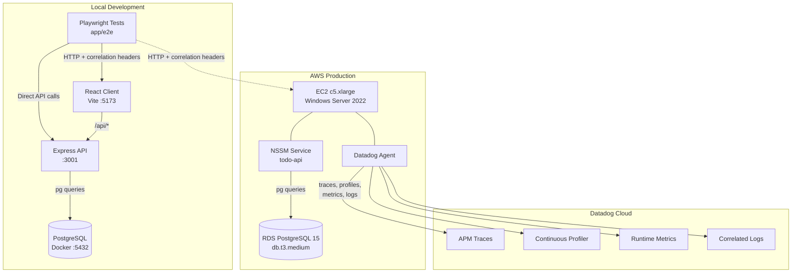
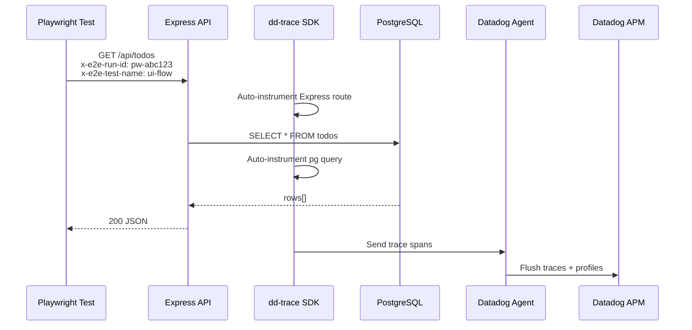
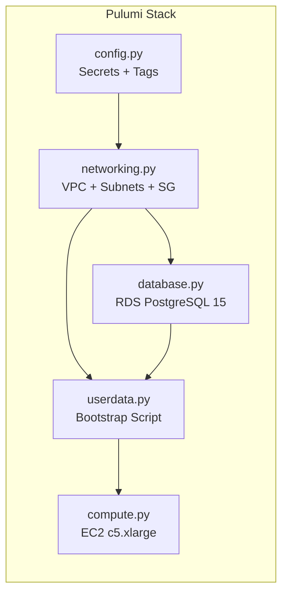

# E2E Real-Time Monitoring

End-to-end testing environment with **Datadog APM tracing** baked into every layer — from the Playwright test runner, through the Express API, down to PostgreSQL queries. Every test run produces a correlated trace you can follow in Datadog to pinpoint exactly which test caused which slow query or error.

## Why This Exists

Traditional e2e tests tell you **pass or fail**. They don't tell you *why* a checkout flow took 4 seconds or which database query spiked during the "toggle todo" step.

This project solves that by wiring **observability directly into the test pipeline**:

- Playwright injects correlation headers (`x-e2e-run-id`, `x-e2e-test-name`) into every HTTP request
- The Express API reads those headers and tags every Datadog trace span with the originating test
- You can open Datadog APM, search by `x-e2e-run-id`, and see the full distributed trace — from browser click to SQL execution — for a single test case

The result: when a test fails or slows down, you already have the production-grade telemetry to debug it.

## Architecture



## Datadog Integration

### How Tracing Works



### APM Setup (dd-trace)

The server entry point (`app/server/src/index.ts`) initializes `dd-trace` **before any other import** — this is critical so the SDK can monkey-patch Express, `pg`, and HTTP modules:

```typescript
import tracer from 'dd-trace';
tracer.init({
  service:        'todo-api',
  env:            'perf-test',
  version:        '1.0.0',
  profiling:      true,        // CPU + heap + wall-clock profiles
  logInjection:   true,        // inject trace_id/span_id into console logs
  runtimeMetrics: true,        // event loop lag, GC stats, heap usage
});
```

| Feature | What It Does |
|---|---|
| **APM Traces** | Every Express route + pg query becomes a span in a distributed trace |
| **Continuous Profiler** | CPU flame graphs and heap snapshots attached to traces |
| **Log Correlation** | `dd.trace_id` and `dd.span_id` injected into log lines for log↔trace linking |
| **Runtime Metrics** | Node.js event loop lag, GC pause time, active handles sent to Datadog |

### E2E Correlation Headers

Playwright attaches these headers to every request (configured in `playwright.config.ts` and `tests/helpers.ts`):

| Header | Purpose | Example |
|---|---|---|
| `x-e2e-run-id` | Unique ID per test run | `pw-1713000000-a1b2c3d4` |
| `x-e2e-source` | Identifies traffic origin | `playwright-e2e` |
| `x-e2e-test-name` | Current test case name | `ui-flow--create-toggle-delete` |

The API logs these alongside Datadog trace IDs, so you can search in Datadog:
```
@x-e2e-run-id:pw-1713000000-a1b2c3d4
```
...and see every trace span generated by that specific test run.

## Project Structure

```
├── app/
│   ├── client/          # React + Vite frontend
│   ├── server/          # Express API with dd-trace
│   │   ├── src/
│   │   │   ├── index.ts       # dd-trace init + Express setup
│   │   │   ├── routes/todos.ts # CRUD with e2e correlation logging
│   │   │   └── db.ts          # pg pool (reads PG* env vars)
│   │   └── migrations/
│   │       └── 001_todos.sql  # Schema + updated_at trigger
│   └── e2e/             # Playwright test workspace
│       ├── playwright.config.ts  # local + ec2 projects, correlation headers
│       └── tests/
│           ├── todo.spec.ts     # UI flow + API flow tests
│           └── helpers.ts       # e2eHeaders(), uniqueTitle(), cleanup
├── infra/               # Pulumi IaC (Python)
│   ├── __main__.py      # Orchestration: network → database → userdata → compute
│   ├── networking.py    # VPC, subnets, IGW, security groups
│   ├── database.py      # RDS PostgreSQL 15 (private subnet, encrypted)
│   ├── compute.py       # EC2 c5.xlarge Windows Server 2022
│   ├── userdata.py      # PowerShell bootstrap: Datadog Agent + app deploy
│   └── config.py        # Pulumi secrets (DD API key, RDS password)
├── start-e2e.ps1        # One-command: DB → server → client → tests
├── stop-e2e.ps1         # Teardown all services
├── start-db.ps1         # Docker PostgreSQL only
├── stop-db.ps1          # Stop Docker PostgreSQL
└── docker-compose.yml   # PostgreSQL 16-alpine container
```

## Running Locally

### Prerequisites

- **Docker Desktop** — for the PostgreSQL container
- **Node.js 20+** — runtime
- **PowerShell 5.1+** — orchestration scripts

### One-Command Start

```powershell
# Start everything and run tests
.\start-e2e.ps1

# Start without running tests (keep services up for manual testing)
.\start-e2e.ps1 -SkipTests

# Silent mode — hidden windows, logs written to .e2e-logs/
.\start-e2e.ps1 -Silent

# Teardown
.\stop-e2e.ps1
```

### Manual Start (Step by Step)

```powershell
# 1. Start PostgreSQL container
.\start-db.ps1

# 2. Start backend (new terminal)
cd app
npm run dev:server

# 3. Start frontend (new terminal)
cd app
npm run dev:client

# 4. Run e2e tests (new terminal)
cd app
npm run test:e2e          # local project only
npm run test:e2e:ui       # Playwright UI mode
```

Open http://localhost:5173 in a browser.

## Deploying to AWS

The `infra/` directory contains a Pulumi stack that provisions a complete environment:



### What Gets Provisioned

| Resource | Spec | Purpose |
|---|---|---|
| VPC | `10.0.0.0/16` with public + 2 private subnets | Network isolation |
| EC2 | `c5.xlarge` Windows Server 2022 | App host (compute-optimized for stable perf tests) |
| RDS | PostgreSQL 15, `db.t3.medium`, encrypted, private subnet | Database (not publicly accessible) |
| Datadog Agent | v7 MSI, auto-installed via userdata | APM, profiling, Windows perf counters |
| NSSM Service | `TodoApp` Windows service | Auto-start Node.js API on boot |

### Deploy Steps

```powershell
cd infra

# Set secrets (one-time)
pulumi config set --secret dd-api-key <YOUR_DATADOG_API_KEY>
pulumi config set --secret rds-password <YOUR_DB_PASSWORD>
pulumi config set repo-url https://github.com/vtanathip/sdet-ai-handbook.git

# Deploy
pulumi up

# Get the public IP
pulumi stack output instance_public_ip
```

### EC2 Bootstrap (userdata.py)

The EC2 instance self-configures on first boot via a PowerShell userdata script that:

1. Downloads and installs the **Datadog Agent MSI** with APM + profiling enabled
2. Writes `windows_performance_counters` config (CPU, memory, disk metrics)
3. Sets all environment variables at the **Machine level** (`DD_*`, `PG*`, `NODE_ENV`)
4. Installs **Node.js**, **Git**, **NSSM**, **psql** via Chocolatey
5. Clones the repo, runs `npm install`, builds client + server
6. Runs the database migration (`001_todos.sql`) against RDS
7. Registers and starts the API as a **Windows service** via NSSM

### Run E2E Tests Against EC2

```powershell
# Using the orchestration script
.\start-e2e.ps1 -Target ec2 -Ec2BaseUrl http://<EC2_PUBLIC_IP>:3001

# Or manually
$env:EC2_BASE_URL = "http://<EC2_PUBLIC_IP>:3001"
cd app
npm run test:e2e:ec2
```

### Tear Down Infrastructure

```powershell
cd infra
pulumi destroy
```
