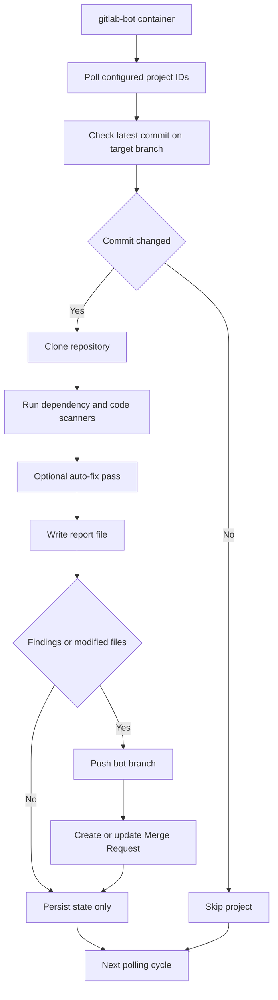

# GitLab Scan Bot (UV + Containers)

Containerized GitLab bot that periodically polls configured projects, scans dependencies and code quality/security, applies safe automated fixes, and opens a Merge Request for human review when issues are detected.

## Architecture



For package-level details, see src/gitlab_bot/README.md.

## Features

- Polling watcher for GitLab projects and branches.
- Dependency scanning using `pip-audit` and `uv` export.
- Code scanning using `bandit` and `ruff`.
- Auto-fix flow:
  - `ruff --fix`
  - optional dependency lock upgrade (`uv lock --upgrade`)
- Merge request creation/update with scan report at `.bot-reports/scan-report.md`.
- Deduplication via persisted finding signature state file.

## Requirements

- Docker + Docker Compose
- GitLab Personal Access Token with API and repository write permissions

## Local GitLab Included

- docker-compose.yml starts two containers: local-gitlab and gitlab-bot.
- GitLab web UI is exposed at http://localhost:8080.
- Bot uses GITLAB_URL=http://gitlab:8080 inside the Docker network.
- GitLab internally runs nginx on `:8080`; Puma is moved to `127.0.0.1:8081` to avoid a port collision during local boot.
- No Windows hosts file edit is required.

## Quick Start

1. Copy environment template:

```bash
cp .env.example .env
```

2. Edit `.env` values:

- `GITLAB_URL`
- `GITLAB_TOKEN`
- `PROJECT_IDS` (comma-separated numeric ids)
- `TARGET_BRANCH` (default `main`)

3. Start local GitLab and bot:

```bash
docker compose up --build -d
```

4. Wait for GitLab to finish booting (first run may take a few minutes):

```bash
docker compose logs -f gitlab
```

5. Open http://localhost:8080 and finish initial setup:

- Sign in as root (initial password is stored in gitlab container at /etc/gitlab/initial_root_password).
- Create a project to be scanned.
- Create a personal access token with api scope.
- Set GITLAB_TOKEN in .env.
- Find the project numeric id and set PROJECT_IDS in .env.

6. Restart bot after updating .env:

```bash
docker compose up -d --force-recreate gitlab-bot
```

7. Follow bot logs:

```bash
docker compose logs -f gitlab-bot
```

## Local Development With UV

```bash
uv sync --extra dev --extra scan
uv run pytest -q
uv run ruff check src tests
uv run python -m gitlab_bot.main
```

## Reusable PowerShell Bootstrap

You can run a single PowerShell script to initialize local GitLab access, create or reuse a test project, update `.env`, restart the bot, and stream logs.

```powershell
Set-Location "E:\Development\repository\sdet-ai-handbook\examples\gitlab-bot"
.\scripts\bootstrap-local-gitlab.ps1 -OpenBrowser
```

Optional arguments:

- `-ProjectName my-project-name`
- `-OpenBrowser` (opens login and token pages)
- `-TailLogs:$false` (skip log streaming)
- `-TimeoutSeconds 1200` (override GitLab wait timeout)

## Documentation Notes

- Diagrams use Mermaid `graph TD` syntax for broad compatibility.
- If your markdown renderer does not support Mermaid, use the step-by-step sections as the source of truth.

## How MR Automation Works

- Bot checks latest commit on target branch.
- If commit changed since last scan, it clones the project.
- It runs scanners and writes `.bot-reports/scan-report.md`.
- If findings exist (or fixes changed files), it pushes bot branch and opens/updates MR.
- State is saved in `STATE_FILE` (default `/data/state.json`) to avoid duplicate MR noise.

## Notes

- This first implementation focuses on Python-oriented dependency scanning.
- For non-Python repositories, dependency scanners may emit notes instead of findings.
- Use `DRY_RUN=true` to validate behavior without pushing branches or creating MRs.
