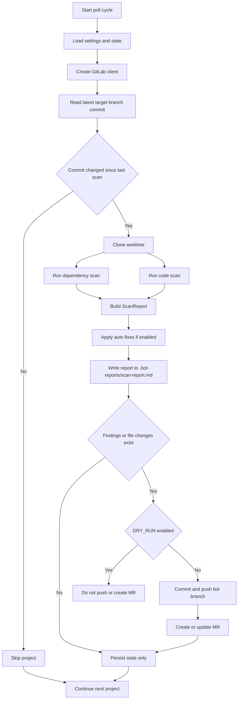

# gitlab_bot Package Guide

This package is the bot runtime used by the container entrypoint. It polls GitLab projects, runs scanners, optionally applies safe fixes, and automates Merge Request updates.

## Runtime Flow

## Why This Diagram Renders Reliably

- Uses `graph TD` syntax, which is broadly supported across GitHub and GitLab renderers.
- Avoids advanced Mermaid directives and class styling.
- Keeps node labels simple to reduce parser edge cases.

## Processing Steps

1. Poll each configured project ID.
2. Compare the latest commit SHA to saved state.
3. Clone and scan only when the commit changed.
4. Build a markdown report and include scanner notes.
5. Push/update bot branch and MR only when needed.
6. Persist state to prevent duplicate MR noise.

## Package Layout

- `main.py`: Poll loop and project processing orchestration.
- `config.py`: Environment-driven settings model.
- `models.py`: Finding and `ScanReport` data models.
- `scanners/dependency.py`: `pip-audit` and outdated dependency checks.
- `scanners/code.py`: `ruff` and `bandit` scan logic.
- `fixers/auto_fix.py`: Safe remediation commands.
- `reporting/report_builder.py`: Markdown report generation.
- `git_ops.py`: Clone, branch, commit, and push operations.
- `gitlab/client.py`: Authenticated GitLab API client setup.
- `gitlab/mr_manager.py`: MR create/update operations.
- `state/store.py`: Deduplication state persistence.
- `subprocess_utils.py`: Command execution wrappers.

## Key Environment Inputs

- `GITLAB_URL`: Base GitLab URL reachable from the bot container.
- `GITLAB_TOKEN`: PAT with API and repository write access.
- `PROJECT_IDS`: Comma-separated numeric project IDs.
- `TARGET_BRANCH`: Branch to watch, default is `main`.
- `POLL_INTERVAL_SECONDS`: Delay between polling cycles.
- `BOT_BRANCH_PREFIX`: Prefix for generated bot branches.
- `DRY_RUN`: If true, run scans and reporting without push/MR.
- `STATE_FILE`: Persistent deduplication file path.

## Failure and Recovery Behavior

- Project processing retries are bounded per cycle.
- Failures for one project do not stop processing others.
- Scanner failures are captured as report notes.
- State persistence keeps behavior idempotent after restarts.

## Expected Output in Target Repositories

- Branch similar to `bot/scan/<shortsha>`.
- Report file at `.bot-reports/scan-report.md`.
- Merge Request similar to `chore(bot): dependency and code scan remediation`.

## Troubleshooting

- If your markdown renderer does not support Mermaid, use the step list above as the canonical runtime reference.
- If diagrams still fail to render, verify Mermaid support in your Git platform and markdown viewer settings.
