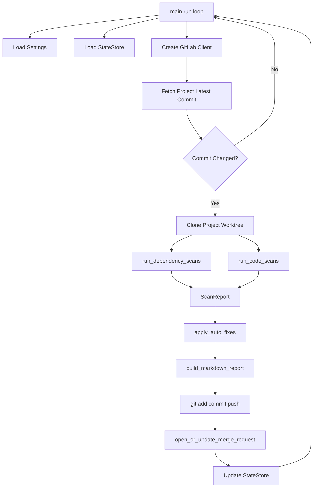
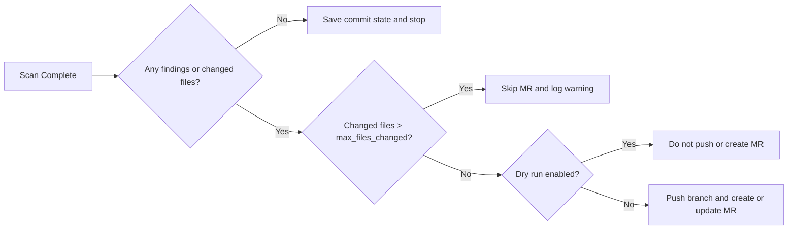

# gitlab_bot Package Guide

This folder contains the runtime engine for the GitLab scanning bot.

## What This Package Does

- Polls configured GitLab projects on a fixed interval.
- Detects new commits on the target branch.
- Clones repository snapshots and runs scanners.
- Applies safe auto-fixes when enabled.
- Writes a machine report for human reviewers.
- Pushes a bot branch and opens or updates a Merge Request.
- Stores state to avoid duplicate MR noise.

## Architecture Overview



## Runtime Sequence

```mermaid
sequenceDiagram
    participant Loop as Bot Loop
    participant API as GitLab API
    participant Repo as Worktree Clone
    participant Scan as Scanners/Fixers
    participant MR as Merge Request

    Loop->>API: Get project + latest commit
    API-->>Loop: commit sha
    Loop->>Loop: Compare with saved state
    alt new commit
        Loop->>Repo: git clone target branch
        Loop->>Scan: dependency scan + code scan
        Scan-->>Loop: findings and notes
        Loop->>Scan: auto-fix (optional)
        Loop->>Repo: write .bot-reports/scan-report.md
        Loop->>Repo: commit and push bot branch
        Loop->>MR: create or update MR
        Loop->>Loop: persist commit + signature
    else unchanged
        Loop->>Loop: skip project
    end
```

## Folder Responsibilities

- main.py: Poll loop, project processing orchestration, MR decision flow.
- config.py: Environment-driven settings model.
- models.py: Finding and ScanReport data structures.
- scanners/dependency.py: pip-audit and outdated dependency checks.
- scanners/code.py: bandit and ruff issue discovery.
- fixers/auto_fix.py: Safe auto-remediation commands.
- reporting/report_builder.py: Markdown report generation.
- git_ops.py: Clone, branch, commit, push operations.
- gitlab/client.py: Authenticated GitLab API client creation.
- gitlab/mr_manager.py: Create or update merge requests.
- state/store.py: Lightweight deduplication state persistence.
- subprocess_utils.py: Shell command execution helper.

## Decision Logic



## Key Environment Inputs

- GITLAB_URL: GitLab base URL reachable from bot container.
- GITLAB_TOKEN: Personal access token with API and repo write scopes.
- PROJECT_IDS: Comma-separated numeric project IDs.
- TARGET_BRANCH: Branch to watch, default main.
- POLL_INTERVAL_SECONDS: Sleep duration between cycles.
- BOT_BRANCH_PREFIX: Prefix for bot-generated branches.
- DRY_RUN: If true, scans and report still run but no push or MR.

## Failure and Recovery Behavior

- Per-project processing has retry with bounded attempts.
- Exceptions in one project do not stop the full polling cycle.
- State is persisted between cycles so restarts remain idempotent.
- If scanners fail, notes are added to report and loop continues.

## Typical Output in Target Repositories

- A bot branch named like bot/scan/abcd1234.
- A markdown report file at .bot-reports/scan-report.md.
- A merge request titled chore(bot): dependency and code scan remediation.

## Extension Ideas

- Add webhook trigger mode in parallel with polling.
- Add severity threshold gating before MR creation.
- Add per-project policy file for fix strategy.
- Add richer report sections with trend history.
