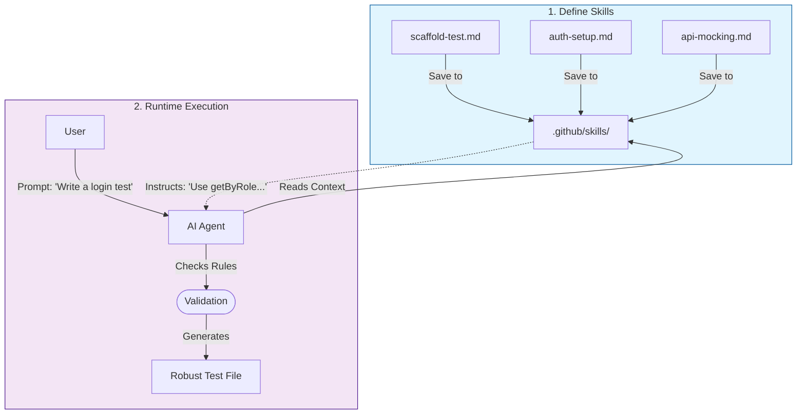

# Playwright Skills Documentation

This document explains how to use the predefined Playwright skills to enhance your testing workflow.

## Overview
Skills are reusable instructions that define *how* you want tests to be written, debugged, and maintained. These skills are now separated into individual files in the `skills` directory for easier management.

## How to Run

### 1. Setup
```bash
npm install
npx playwright install
```

### 2. Start Application
```bash
npm run dev
```

### 3. Agent Demo
Ask your AI Agent (Copilot) in this workspace:
> "Write a test for the Todo App to verify adding a task."

The agent will use the skills defined in `.github/skills/` to generate high-quality code.

## How to Trigger Skills

By default, the Agent doesn't "know" about these skills unless you prompt it. However, we have added a **[.github/copilot-instructions.md](.github/copilot-instructions.md)** file to this repository.

This special configuration file instructs the Agent to **always** check the `.github/skills/` directory for relevant patterns before generating code.

You do **NOT** need to explicitly mention "Use the api-mocking skill."
Simply ask: *"Write a test using mocks."*
The agent will automatically apply the patterns from `api-route-mocking.md`.

## Workflow Visualization

The following diagram illustrates how the AI Agent uses your defined skills to generate high-quality code.



## How to Use Each Skill

Use these prompts directly with your AI Agent in this workspace. Because `.github/copilot-instructions.md` already points to `.github/skills/`, the agent can automatically apply the right skill.

### 1. scaffold-playwright-test
* **Skill File**: `.github/skills/scaffold-playwright-test.md`
* **When to Use**: You want a new Playwright spec file with good locator and assertion patterns.
* **Prompt Example**: "Create a Playwright test for Todo app: add task, validate list item, validate input is cleared."
* **What You Should See**: Agent generates tests using `getByRole`, `getByPlaceholder`, and `expect(...).toBeVisible()` patterns.

### 2. auth-setup
* **Skill File**: `.github/skills/auth-setup.md`
* **When to Use**: Your tests require login and you want to reuse authenticated session state.
* **Prompt Example**: "Set up Playwright auth once in global setup and reuse storage state for all tests."
* **What You Should See**: Agent proposes `global-setup.ts` and `storageState` config in Playwright.

### 3. api-route-mocking
* **Skill File**: `.github/skills/api-route-mocking.md`
* **When to Use**: You want deterministic frontend tests without depending on real API services.
* **Prompt Example**: "Mock GET /api/todos with Playwright route.fulfill and test empty-state and success-state UI."
* **What You Should See**: Agent uses `page.route(...)` with mock JSON payloads and status codes.

### 4. visual-regression
* **Skill File**: `.github/skills/visual-regression.md`
* **When to Use**: You need screenshot comparisons to catch unintended UI changes.
* **Prompt Example**: "Add a visual regression test for the Todo page and assert full-page screenshot."
* **What You Should See**: Agent adds `toHaveScreenshot()` checks and snapshot update guidance.

### 5. debug-test
* **Skill File**: `.github/skills/debug-test.md`
* **When to Use**: A test fails and you need trace/UI/step-by-step debugging.
* **Prompt Example**: "This Todo test is flaky. Add debug steps and explain how to run with --debug and trace."
* **What You Should See**: Agent suggests `page.pause()`, debug commands, and trace configuration.

### 6. generate-report
* **Skill File**: `.github/skills/generate-report.md`
* **When to Use**: You want a readable test execution report for local debugging or CI artifacts.
* **Prompt Example**: "Configure Playwright reporters and show how to open the HTML report after tests."
* **What You Should See**: Agent configures reporter settings and `playwright show-report` workflow.

## Quick Prompt Templates

Use these short prompts to force a specific skill quickly:

1. "Use scaffold-playwright-test patterns to create a new spec for Todo delete flow."
2. "Apply auth-setup to store login state and reuse it across tests."
3. "Use api-route-mocking to stub /api/tasks and assert rendered task rows."
4. "Apply visual-regression to verify Todo page layout snapshot."
5. "Use debug-test guidance to troubleshoot a flaky Enter-key test."
6. "Use generate-report to configure HTML report and CI artifact upload."

## Chat Interaction Examples

Use a conversational style. You can start broad, then refine with follow-up prompts.

### Example A: Create a New Test (scaffold-playwright-test)

**You**:
"Create a Playwright test for Todo app that adds a task and verifies the input is cleared."

**Then You (follow-up)**:
"Refactor the test to use `getByRole` only where possible and add `test.step()` labels."

**Expected Agent Behavior**:
The agent creates or updates a spec with stable locators, web-first assertions, and clear test steps.

### Example B: Add Authentication Flow (auth-setup)

**You**:
"Set up one-time login for Playwright and reuse auth session for all tests."

**Then You (follow-up)**:
"Use `storageState` and show me exactly which files were changed."

**Expected Agent Behavior**:
The agent adds a global auth setup flow and wires it in `playwright.config.ts`.

### Example C: Mock API Responses (api-route-mocking)

**You**:
"Mock `/api/todos` so tests do not hit backend. Include success and error cases."

**Then You (follow-up)**:
"Add one assertion for empty state and one for populated list state."

**Expected Agent Behavior**:
The agent adds route interception with deterministic payloads and targeted UI assertions.

### Example D: Debug a Failing Test (debug-test)

**You**:
"My Enter-key test is flaky. Help me debug it."

**Then You (follow-up)**:
"Add temporary `page.pause()` and show debug commands I should run next."

**Expected Agent Behavior**:
The agent adds debug hooks and provides command-level guidance (`--debug`, trace, UI mode).

### Example E: Visual Snapshot Protection (visual-regression)

**You**:
"Add visual regression coverage for Todo page."

**Then You (follow-up)**:
"Scope it to the list container first, then full-page screenshot."

**Expected Agent Behavior**:
The agent adds screenshot assertions in a way that minimizes flaky snapshot diffs.

### Example F: Generate and Review Reports (generate-report)

**You**:
"Configure reporter output and show me how to open HTML report."

**Then You (follow-up)**:
"Include a CI artifact upload example for the report folder."

**Expected Agent Behavior**:
The agent configures reporters and provides local + CI report workflow.

## Chat Tips for Better Results

1. Start with intent: "Create test", "Debug flaky test", "Mock API", "Add visual checks".
2. Add constraints: browser, file name, endpoint, selector style, assertion style.
3. Ask for diffs: "Show changed files and why." 
4. Iterate in short loops: prompt, review output, ask focused follow-up.
5. Ask for runnable commands at the end: install, test, debug, report.

## Workflow Example

1.  **Define**: Place the `.md` files in `.github/skills/` (or similar config path).
2.  **Trigger**: Ask the agent: *"Write a test for the Todo app using API mocking."*
3.  **Execute**: The agent reads the relevant skill file (e.g., `skills/api-route-mocking.md`) and follows its instructions.

## Benefits
*   **Modularity**: Each skill is defined in its own file, making it easier to read and update.
*   **Consistency**: Every test uses the same locator strategy.
*   **Speed**: No need to look up syntax for mocking or screenshots.
*   **Maintenance**: Update a single skill file to roll out new practices team-wide.