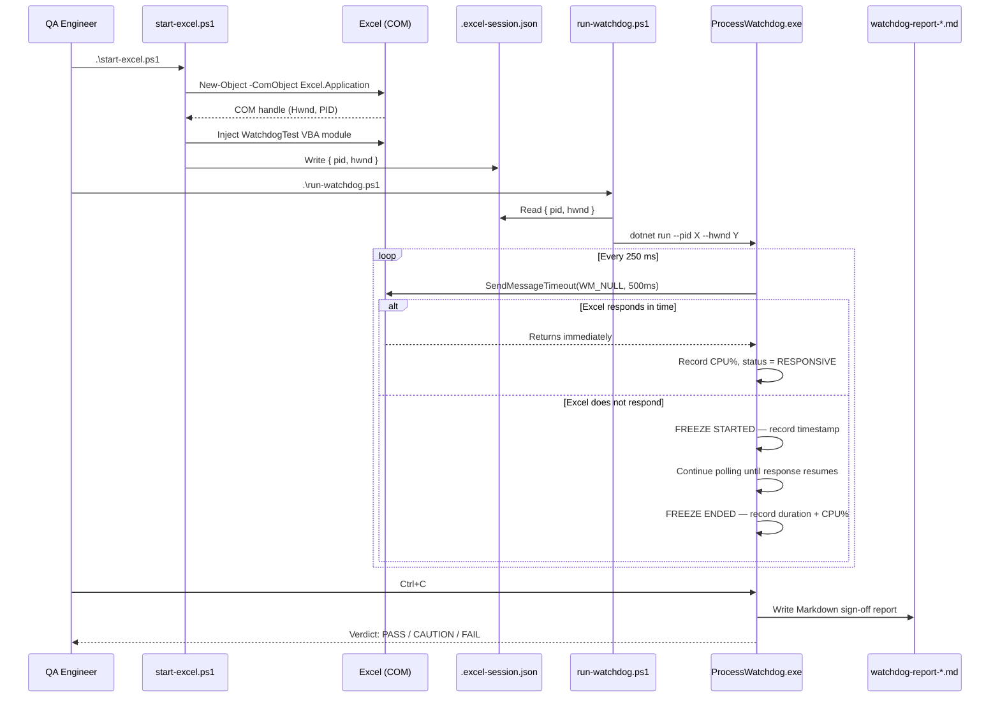
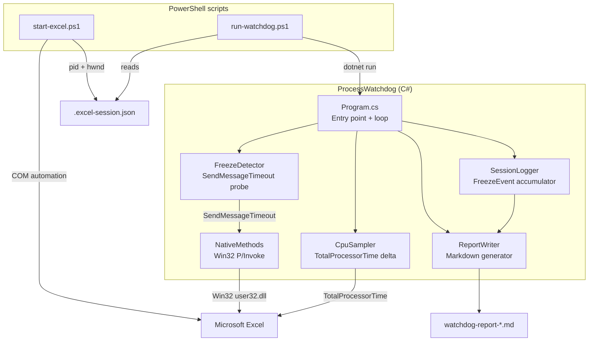

# How It Works

## Overview

Excel Process Watchdog detects UI-thread freezes in Excel by probing its message queue at 250 ms intervals using the Windows `SendMessageTimeout` API. Any probe that takes longer than the configured threshold (default 500 ms) is recorded as a freeze event. At the end of a session, all events are compiled into a Markdown sign-off report.

---

## End-to-end flow



---

## Component map



---

## Freeze detection algorithm

The core probe is a single Win32 call repeated every 250 ms:

```csharp
SendMessageTimeout(
    hwnd,               // Excel's main window handle
    WM_NULL,            // harmless message — no action required
    0, 0,
    SMTO_ABORTIFHUNG,   // return immediately if already hung
    500,                // timeout in ms (configurable)
    out _)
```

> **Official API reference:**
> [`SendMessageTimeout` — Win32 API (user32.dll)](https://learn.microsoft.com/en-us/windows/win32/api/winuser/nf-winuser-sendmessagetimeoutw) ·
> [`WM_NULL` message](https://learn.microsoft.com/en-us/windows/win32/winmsg/wm-null)

**Why `WM_NULL` + `SendMessageTimeout`?**

Windows' message pump is the heartbeat of any UI thread. If a thread is blocked — waiting on a lock, a COM call, or a synchronous I/O — it stops draining its message queue. `SendMessageTimeout` attempts to deliver a message synchronously: if the target thread retrieves and processes it within the timeout, the call returns non-zero (responsive). If not, it returns zero (frozen).

This is the same mechanism Windows Task Manager uses to show "(Not Responding)". Microsoft documents this pattern explicitly in their Windows application quality guidelines:

> *"To detect a hang, you can send the `WM_NULL` message to the window with `SendMessageTimeout`. If the function returns before the timeout expires, the application is not hung."*
>
> — [Preventing Hangs in Windows Applications](https://learn.microsoft.com/en-us/windows/win32/win7appqual/preventing-hangs-in-windows-applications), Windows Dev Center

The `SMTO_ABORTIFHUNG` flag is also part of this standard pattern — it causes the call to return immediately if Windows has already classified the window as hung (i.e., no `GetMessage` call for > 5 seconds), rather than waiting the full timeout.

> **Related API:** [`IsHungAppWindow`](https://learn.microsoft.com/en-us/windows/win32/api/winuser/nf-winuser-ishungappwindow) — the Win32 function Windows Explorer itself calls to determine whether to show the "(Not Responding)" label. We use `SendMessageTimeout` instead because it is more precise and configurable, but both operate on the same underlying message-queue mechanism.

**State machine:**

```text
          ┌─────────────────────────────────────────────────────┐
          │                    POLL TICK (every 250ms)          │
          │                                                      │
  ┌───────▼───────┐    result == 0        ┌───────────────────┐ │
  │  RESPONSIVE   │──────────────────────►│     FROZEN        │ │
  │               │                       │  emit FreezeStart │ │
  │  emit nothing │◄──────────────────────│  record timestamp │ │
  └───────────────┘    result != 0        └───────────────────┘ │
          │                                                      │
          └─────────────────────────────────────────────────────┘

  On transition FROZEN → RESPONSIVE:
    duration = now − freezeStart
    emit FreezeEnded(duration, peakCpu%)
    SessionLogger.RecordFreezeEnd(...)
```

> **Further reading:** [About Messages and Message Queues](https://learn.microsoft.com/en-us/windows/win32/winmsg/about-messages-and-message-queues) — Microsoft's authoritative explanation of how Windows message pumps work.

---

## CPU correlation

On every poll tick, `CpuSampler` computes CPU% since the last tick:

```text
cpuDelta  = Process.TotalProcessorTime(now) − TotalProcessorTime(last)
wallDelta = now − last
cpu%      = cpuDelta.ms / (wallDelta.ms × logicalCores) × 100
```

> **Official API reference:** [`Process.TotalProcessorTime` — .NET API](https://learn.microsoft.com/en-us/dotnet/api/system.diagnostics.process.totalprocessortime)

This is paired with each freeze event, giving the tester a diagnostic signal:

| Pattern | Interpretation |
| --- | --- |
| High CPU + frozen | Excel is busy calculating (expected during formula injection) |
| Low CPU + frozen | Possible deadlock, COM re-entrancy, or I/O wait — investigate |

---

## Session file

`start-excel.ps1` writes `.excel-session.json` after launching Excel:

```json
{
  "pid": 29144,
  "hwnd": 1116902
}
```

**Why store the `hwnd`?**
Excel launched via COM (`/automation -Embedding`) has `Process.MainWindowHandle = 0` in .NET — the window exists but .NET's process API doesn't recognise it as the main window. The COM object's `Hwnd` property gives the real handle. Storing it in the session file lets `run-watchdog.ps1` pass it directly to the C# app, bypassing the unreliable `Process.MainWindowHandle`.

`run-watchdog.ps1` falls back through three strategies if no session file exists:

```text
1. --hwnd from session file       ← most reliable (always used when available)
2. Process.MainWindowHandle       ← works for normally-launched Excel
3. EnumWindows scan               ← last resort: enumerate all visible windows for the PID
```

> **Official API references:**
> [`GetWindowThreadProcessId`](https://learn.microsoft.com/en-us/windows/win32/api/winuser/nf-winuser-getwindowthreadprocessid) — resolves a window handle to its owning process ID ·
> [`EnumWindows`](https://learn.microsoft.com/en-us/windows/win32/api/winuser/nf-winuser-enumwindows) — enumerates all top-level windows on the desktop

Excel is launched using the **COM Automation** model, which is the official Microsoft-supported way to drive Office programmatically:

> **Excel object model reference:** [Excel Application object (VBA)](https://learn.microsoft.com/en-us/office/vba/api/excel.application)

---

## Sign-off verdict

Computed from `SessionLogger` at report time:

```text
FreezeCount == 0              → PASS   (exit code 0)
LongestFreeze < 3 s           → CAUTION (exit code 1)
LongestFreeze >= 3 s          → FAIL   (exit code 2)
```

The 3-second threshold aligns with Microsoft's own guidance: applications that do not process messages for more than 5 seconds are classified as "hung" by the operating system. Using 3 seconds gives teams an earlier warning before Windows itself intervenes.

> *"The Windows operating system detects application hangs after 5 seconds of unresponsiveness."*
>
> — [Preventing Hangs in Windows Applications](https://learn.microsoft.com/en-us/windows/win32/win7appqual/preventing-hangs-in-windows-applications), Windows Dev Center

The exit code can be read by a CI pipeline to gate release builds automatically.

---

## Data flow summary

```text
Excel UI thread
      │
      │  WM_NULL probe (250ms interval)
      ▼
FreezeDetector ──► freeze event ──► SessionLogger ──► FreezeEvent list
      │                                                      │
CpuSampler ──────────────────────────────────────────────────┘
                                                             │
                                                      ReportWriter
                                                             │
                                               watchdog-report-*.md
```

---

## References

All techniques in this tool are grounded in official Microsoft documentation.

| Technique | Official Reference |
| --- | --- |
| Detecting application hangs | [Preventing Hangs in Windows Applications](https://learn.microsoft.com/en-us/windows/win32/win7appqual/preventing-hangs-in-windows-applications) — Windows Dev Center |
| `SendMessageTimeout` API | [SendMessageTimeoutW function (winuser.h)](https://learn.microsoft.com/en-us/windows/win32/api/winuser/nf-winuser-sendmessagetimeoutw) — Win32 API |
| `WM_NULL` message | [WM_NULL message](https://learn.microsoft.com/en-us/windows/win32/winmsg/wm-null) — Win32 API |
| `IsHungAppWindow` API | [IsHungAppWindow function (winuser.h)](https://learn.microsoft.com/en-us/windows/win32/api/winuser/nf-winuser-ishungappwindow) — Win32 API |
| Windows message queue | [About Messages and Message Queues](https://learn.microsoft.com/en-us/windows/win32/winmsg/about-messages-and-message-queues) — Win32 API |
| `GetWindowThreadProcessId` API | [GetWindowThreadProcessId function (winuser.h)](https://learn.microsoft.com/en-us/windows/win32/api/winuser/nf-winuser-getwindowthreadprocessid) — Win32 API |
| `EnumWindows` API | [EnumWindows function (winuser.h)](https://learn.microsoft.com/en-us/windows/win32/api/winuser/nf-winuser-enumwindows) — Win32 API |
| CPU usage measurement | [Process.TotalProcessorTime Property](https://learn.microsoft.com/en-us/dotnet/api/system.diagnostics.process.totalprocessortime) — .NET API |
| Excel COM automation | [Excel Application object (Office VBA)](https://learn.microsoft.com/en-us/office/vba/api/excel.application) — Microsoft 365 Dev Center |
| Platform Invoke (P/Invoke) | [Platform Invoke (P/Invoke)](https://learn.microsoft.com/en-us/dotnet/standard/native-interop/pinvoke) — .NET documentation |
