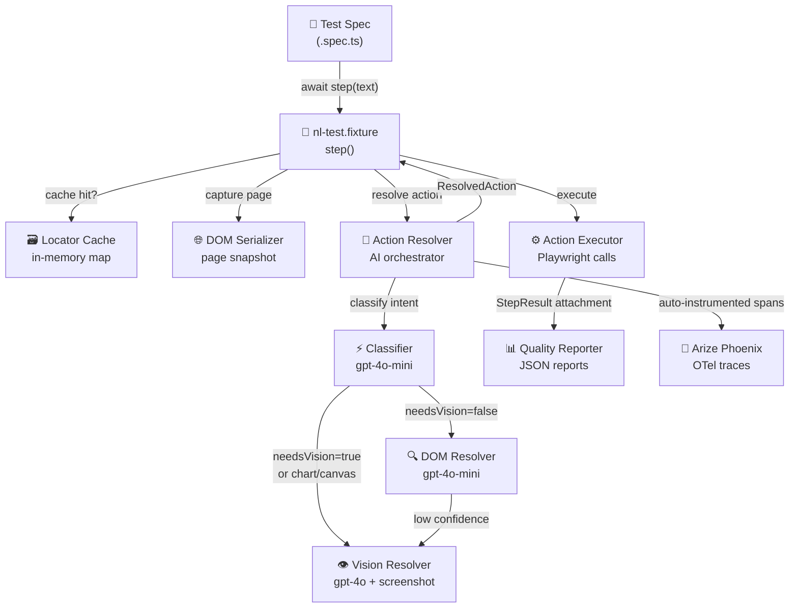
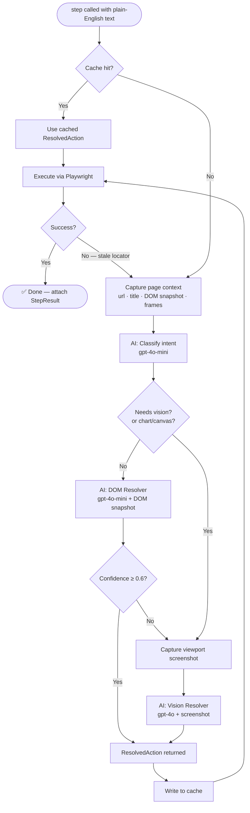
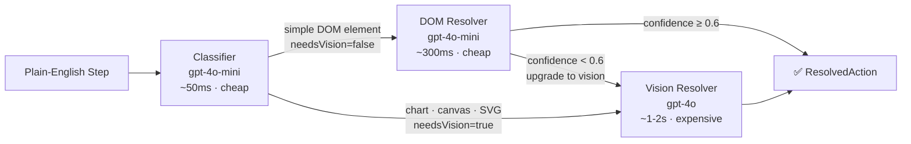
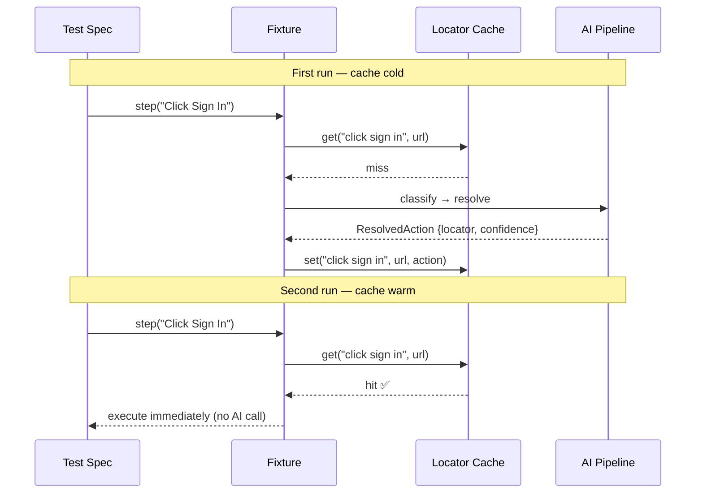
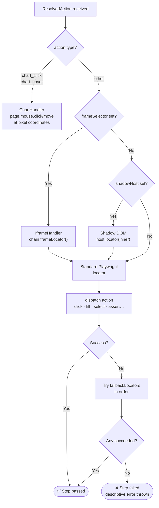
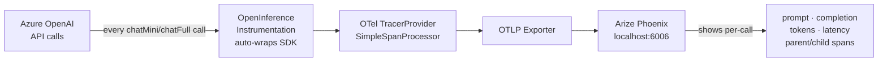
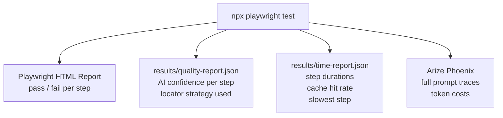

# Project Workflow

> How plain-English test steps become real browser interactions via AI.

---

## What is this project?

Instead of writing Playwright selectors by hand, you write test steps in natural language. The AI figures out *what* to click, *where* it is on the page, and *how* to interact with it — automatically.

```ts
// What you write
await step('Enter user@example.com in the email field');
await step('Click the Sign In button');
await step('Verify the dashboard heading is visible');
```

No selectors. No `page.locator(...)`. The AI handles it.

---

## Big Picture — Component Map



---

## Step-by-Step Flow — What Happens When You Call `step()`



---

## AI Decision Tree — Which Model Gets Called?



---

## Cache — How It Speeds Up Tests

On first run every step calls the AI. On repeated runs (same URL + same step text), the result is served from the in-memory cache — **no AI call, no cost, ~10x faster**.



---

## Executor — Handling Edge Cases



---

## Observability — Every AI Call is Traced



---

## Output — What You Get After a Test Run



---

## Key Environment Variables

| Variable | Purpose | Default |
|---|---|---|
| `BASE_URL` | App URL under test | required |
| `AZURE_OPENAI_ENDPOINT` | Azure OpenAI resource | required |
| `AZURE_OPENAI_API_KEY` | API key | required |
| `AZURE_OPENAI_DEPLOYMENT` | Full model (gpt-4o) | `gpt-4o` |
| `AZURE_OPENAI_MINI_DEPLOYMENT` | Mini model (gpt-4o-mini) | `gpt-4o-mini` |
| `AI_CONFIDENCE_THRESHOLD` | Escalate DOM→Vision below this | `0.6` |
| `AI_MAX_RETRIES` | Retry attempts per step | `2` |
| `DOM_MAX_TOKENS` | Token budget for DOM snapshot | `4000` |
| `PHOENIX_ENDPOINT` | Arize Phoenix OTel endpoint | `http://localhost:6006` |
