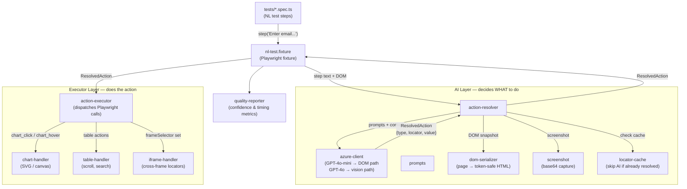
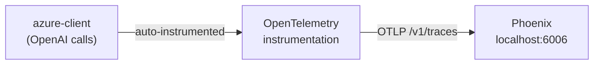

# Prompt Testing

Natural-language Playwright tests powered by Azure OpenAI. Write test steps in plain English — the AI resolves them to DOM actions at runtime.

## Architecture



## Modules

| Path | Responsibility |
| ---- | ------------- |
| `tests/` | Test specs — each step is a plain-English instruction |
| `src/fixtures/nl-test.fixture.ts` | Playwright fixture that wires `step()` to the AI pipeline |
| `src/ai/action-resolver.ts` | Sends DOM + screenshot to GPT-4o, returns a typed action plan |
| `src/ai/azure-client.ts` | Azure OpenAI wrapper — `chatMini` for classification, `chatFull` for vision |
| `src/ai/prompts.ts` | System prompts for intent classification and element resolution |
| `src/executor/action-executor.ts` | Executes resolved actions (click, fill, assert, hover…) on the Playwright page |
| `src/executor/chart-handler.ts` | Specialised actions for SVG/canvas chart interactions |
| `src/executor/table-handler.ts` | Scroll, search, and interact with data tables |
| `src/executor/iframe-handler.ts` | Resolves elements inside iframes |
| `src/cache/locator-cache.ts` | Caches AI-resolved selectors to avoid redundant API calls |
| `src/utils/dom-serializer.ts` | Strips the live DOM down to a token-safe HTML snapshot |
| `src/utils/screenshot.ts` | Captures a base64 screenshot for vision calls |
| `src/reporter/quality-reporter.ts` | Post-run AI quality metrics (confidence, retry rate, step timings) |
| `config/index.ts` | Single config — `BASE_URL`, `TEST_USER_EMAIL`, `TEST_USER_PASSWORD` |

## Cost

Every test step makes 2–3 API calls depending on element complexity.

**DOM path** (most steps — button, input, link):

| Call | Model | Tokens (est.) | Cost/step |
| ---- | ----- | ------------- | --------- |
| Classifier | gpt-4o-mini | ~230 in / ~30 out | ~$0.00004 |
| DOM resolver | gpt-4o-mini | ~4,200 in / ~100 out | ~$0.0007 |
| **Total** | | | **~$0.001** |

**Vision path** (charts, canvas, low-confidence DOM):

| Call | Model | Tokens (est.) | Cost/step |
| ---- | ----- | ------------- | --------- |
| Classifier | gpt-4o-mini | ~230 in / ~30 out | ~$0.00004 |
| DOM resolver | gpt-4o-mini | ~4,200 in / ~100 out | ~$0.0007 |
| Vision resolver | gpt-4o | ~1,000 in + screenshot / ~100 out | ~$0.015 |
| **Total** | | | **~$0.016** |

**Example estimates:**

| Scenario | Steps | Est. cost |
| -------- | ----- | --------- |
| Login test (DOM only) | 4 | ~$0.003 |
| Full suite — 3 specs (DOM only) | 20 | ~$0.02 |
| Full suite with chart tests (mixed) | 20 | ~$0.15 |

**What keeps costs low:**

- DOM is capped at 4,000 tokens (`DOM_MAX_TOKENS`) — invisible nodes, scripts, and SVG subtrees are stripped
- `locator-cache` skips AI entirely for repeated steps on the same URL
- GPT-4o vision is only used when the classifier flags `needsVision=true` or DOM confidence drops below `AI_CONFIDENCE_THRESHOLD` (default 0.6)

## Observability

Every AI call is traced automatically via [Arize Phoenix](https://github.com/arize-ai/phoenix) + OpenTelemetry. You get full visibility into prompts, completions, token usage, latency, and confidence per test step.



**What you see in Phoenix per test run:**

- Each `chatMini` / `chatFull` call as a span with input prompt and output
- Token counts (input / output / total) per step
- Latency per AI call
- Full conversation history — useful for debugging why the AI picked the wrong locator

**Start Phoenix locally:**

```bash
docker compose up -d
```

Then open **[http://localhost:6006](http://localhost:6006)** — traces appear as soon as tests run.

**Configuration:**

```bash
# .env — override if Phoenix is remote
PHOENIX_ENDPOINT=http://localhost:6006
```

The instrumentation is in `src/instrumentation.ts` and is loaded automatically when `azure-client.ts` is imported.

## Setup

```bash
cp .env.example .env   # fill in Azure OpenAI creds + target URL
npm install
npm run test:login     # headless
npm run test:login:headed  # visible browser
npm test               # all specs
```
