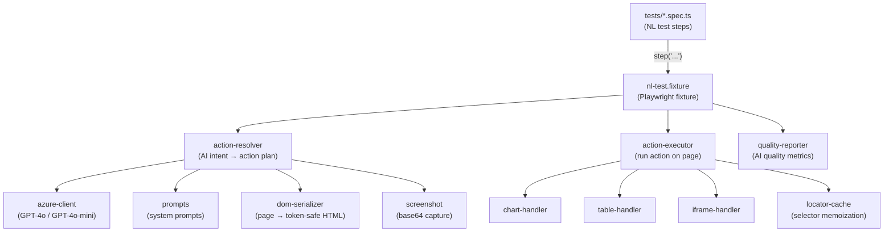

# Prompt Testing

Natural-language Playwright tests powered by Azure OpenAI. Write test steps in plain English — the AI resolves them to DOM actions at runtime.

## Architecture



## Modules

| Path | Responsibility |
|------|---------------|
| `tests/` | Test specs — each step is a plain-English instruction |
| `src/fixtures/nl-test.fixture.ts` | Playwright fixture that wires `step()` to the AI pipeline |
| `src/ai/action-resolver.ts` | Sends DOM + screenshot to GPT-4o, returns a typed action plan |
| `src/ai/azure-client.ts` | Azure OpenAI wrapper — `chatMini` for classification, `chatFull` for vision |
| `src/ai/prompts.ts` | System prompts for intent classification and element resolution |
| `src/executor/action-executor.ts` | Executes resolved actions (click, fill, assert, hover…) on the Playwright page |
| `src/executor/chart-handler.ts` | Specialised actions for SVG/canvas chart interactions |
| `src/executor/table-handler.ts` | Scroll, search, and interact with data tables |
| `src/executor/iframe-handler.ts` | Resolves elements inside iframes |
| `src/cache/locator-cache.ts` | Caches AI-resolved selectors to avoid redundant API calls |
| `src/utils/dom-serializer.ts` | Strips the live DOM down to a token-safe HTML snapshot |
| `src/utils/screenshot.ts` | Captures a base64 screenshot for vision calls |
| `src/reporter/quality-reporter.ts` | Post-run AI quality metrics (confidence, retry rate, step timings) |
| `config/index.ts` | Single config — `BASE_URL`, `TEST_USER_EMAIL`, `TEST_USER_PASSWORD` |

## Setup

```bash
cp .env.example .env   # fill in Azure OpenAI creds + target URL
npm install
npm run test:login     # headless
npm run test:login:headed  # visible browser
npm test               # all specs
```
