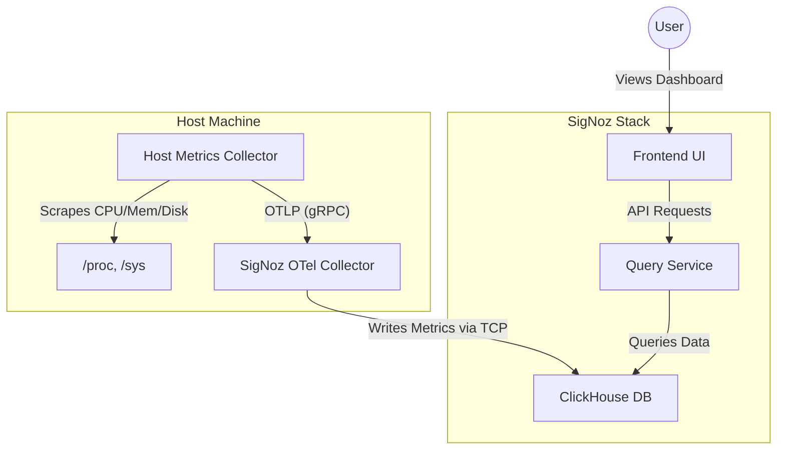

# Realtime Host Monitoring with SigNoz

This example demonstrates how to set up a realtime host monitoring system using **SigNoz** as the backend and **OpenTelemetry (OTel) Collector** for data collection.

## Architecture



## Prerequisites

- **Docker** and **Docker Compose** installed.
- Linux/Mac host recommended for full metric support (Windows users may see limited metrics due to `/proc` filesystem differences, but basic CPU/Mem usually works via APIs or WSL2).

## Quick Start

1.  **Start the services**:
    ```bash
    docker-compose up -d
    ```

2.  **Access the Dashboard**:
    Open [http://localhost:3301](http://localhost:3301) in your browser.

3.  **Create an Account**:
    Follow the on-screen instructions to create the initial admin account.

4.  **View Host Metrics**:
    - Go to **Dashboards**.
    - Look for a pre-configured **"Host Metrics"** dashboard (SigNoz often includes this default).
    - If not present, create a new dashboard and add widgets for `system.cpu.utilization`, `system.memory.usage`, etc.

## Service Discovery

The configuration sets the `service.name` to **`host-monitoring-service`**. 
- In SigNoz, you can filter metrics by this service name to isolate host monitoring data from other application data.
- This allows you to treat your infrastructure monitoring just like any other microservice in the system.

## Configuration Details

- **`host-metrics-otel-config.yaml`**: The agent configuration running on the host network. Scrapes metrics every 10 seconds.
- **`signoz-otel-collector-config.yaml`**: The backend collector configuration. Receives OTLP data and writes to ClickHouse.
- **`docker-compose.yaml`**: Orchestrates the interaction between the OTel agents and the SigNoz backend.

## Debugging

If you don't see data:

1.  **Check Collector Logs**:
    ```bash
    docker logs host-metrics-collector
    docker logs signoz-otel-collector
    ```
    Look for "Exporting failed" or connection errors.

2.  **Verify OTLP Connection**:
    Ensure port `4317` is accessible on localhost.

3.  **Check ClickHouse**:
    If the collector says "success" but no data appears, check ClickHouse logs:
    ```bash
    docker logs signoz-clickhouse
    ```
    
## Visualization

1.  Navigate to **Dashboards** -> **New Dashboard**.
2.  Add a **Time Series** panel.
3.  Query generic metrics like:
    - `system_cpu_utilization` (average)
    - `system_memory_usage` (sum)
    - `system_disk_io`
